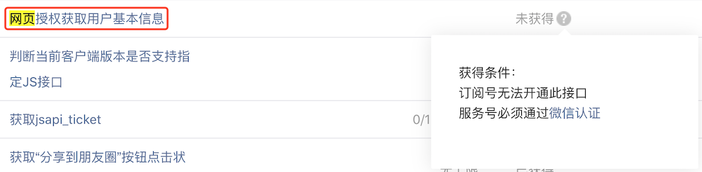
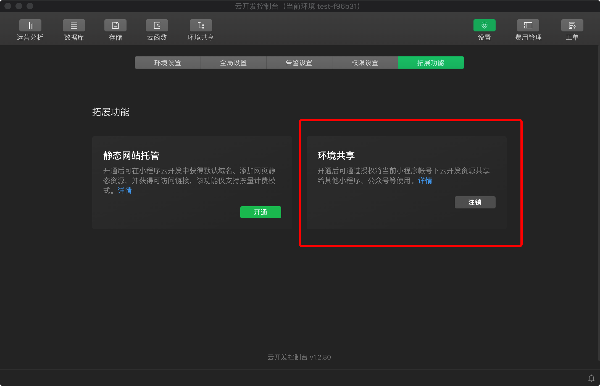
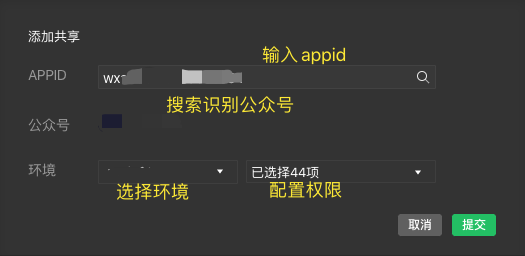
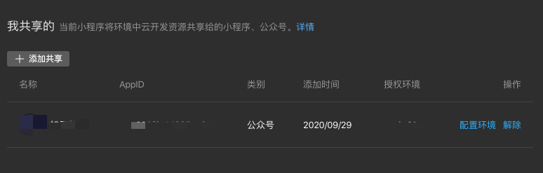
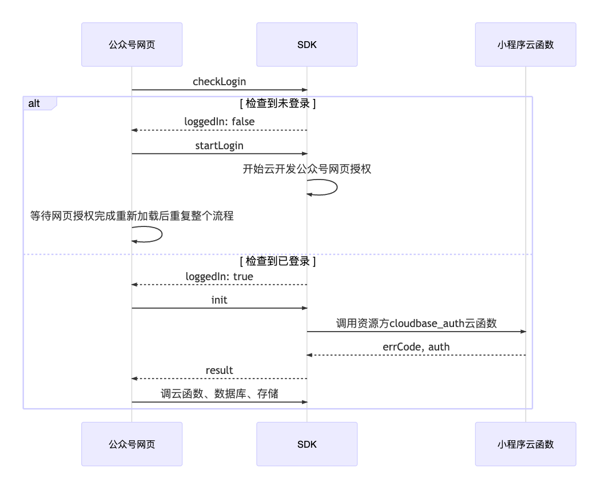
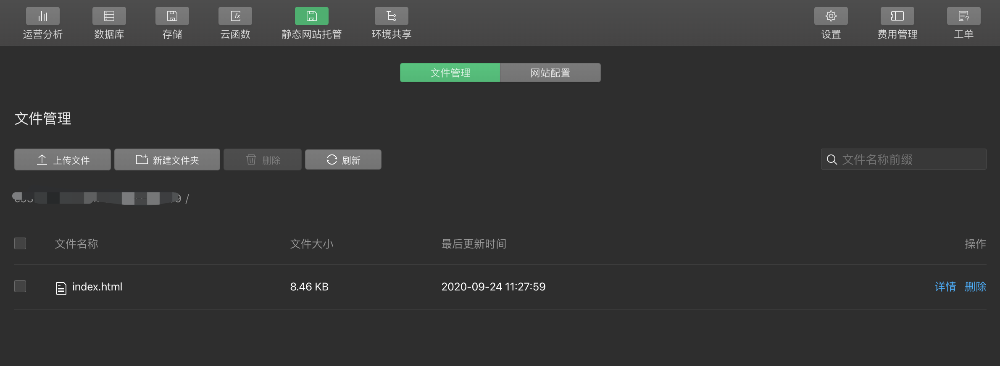
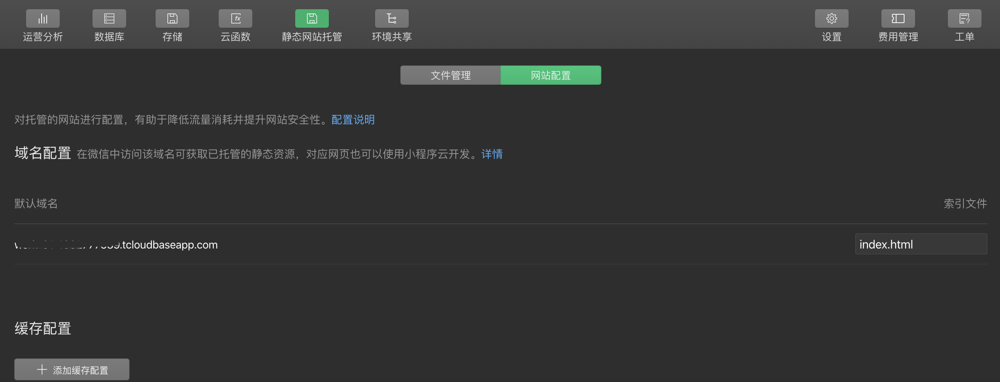
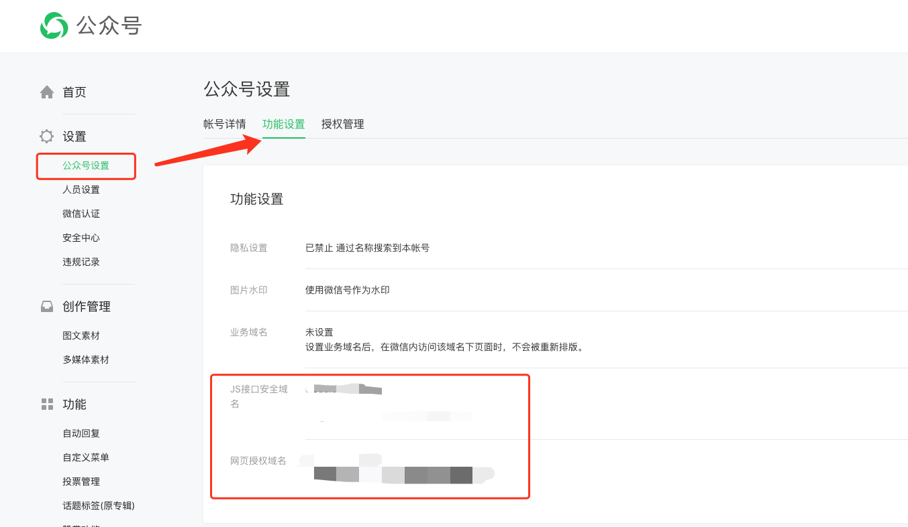

# 云开发云原生实战｜5步完成公众号TODO应用

## 前言
小程序·云开发支持同主体间应用环境共享，包含小程序和公众号。云开发在公众号云原生后端支持上终于和小程序并列了。

云开发在小程序中支持的免鉴权，免token验证，云调用等，在公众号应用中也可以被开发者轻松使用了。

本次实战就以TODO应用为例子，实战讲解一下云开发如何使用支持公众号开发。

## 第一步：部署环境共享
目前只有小程序才能够创建小程序·云开发环境，所以我们在接下来公众号应用开发所使用的环境，必须来自小程序的环境共享设置。

并且云开发所共享的公众号主体也必须有使用网页授权的权限，从目前的条件看来，只有已认证的服务号才具备此条件。


我们准备好满足条件的公众号后，获取服务号的appid，进行接下来的设置

使用 1.03.2009140 或以上版本的微信开发者工具，登录与服务号同主体的，用于共享云开发资源的小程序。

在云开发控制台的【设置 - 拓展能力 - 环境共享】上开通环境共享


开通成功后，重新启动云开发控制台，即可在顶部栏看到【环境共享】，点击进入部署；


输入服务号appid，配置即可，配置完毕后，环境部署共享即完成。需要注意，本次实战需要全部勾选数据库、存储、云函数调用权限。


保存小程序的appid，以及共享的云开发环境id。

## 第二步：配置云开发cloudbase_auth
我们首先看一下公众号的登录流程，在前期主要是云开发和公众号之间进行一些授权调用，自助发起用户权限申请，在前期授权完毕后，初始化云开发在公众号的SDK实例时，需要向云开发环境下的cloudbase_auth函数发起申请，才可以完成整个初始化流程。


资源方 cloudbase_auth 云函数返回的对象结构协议：

|  属性    | 类型  | 	必填 |	说明 |
|  ----  | ----  | ----  |  ----  |
| errCode | number|是| 自定义错误码，0 表示授权通过，非 0 表示拒绝授权，会透传回给调用方|
| errMsg	| string|否| 自定义错误信息，errCode 非 0 时透传回给调用方|
| auth	  | string|否| 安全规则对象，必须序列化成字符串|

我们开发者可以控制此函数，进行有效的控制，在本次实战中，函数代码如下：
``` js
const cloud = require('wx-server-sdk')
cloud.init({
  env: cloud.DYNAMIC_CURRENT_ENV
})

// 云函数入口函数
exports.main = async (event, context) => {
  const wxContext = cloud.getWXContext()    //可获取有关信息，包括appid、openid等

  return {
    errCode: 0,                             //一律给0通过，可以根据自己的业务判别用户通过
    errMsg: `${wxContext.FROM_OPENID}`,     //我们将用户的openid传递给前端，用于业务
    auth: JSON.stringify({
      // 自定义安全规则
      // 在前端访问资源方数据库、云函数等资源时，资源方可以通过
      // 安全规则的 `auth.custom` 字段获取此对象的内容做校验
    }),
  }
}
```
将代码通过开发者工具上传部署到环境中即可。

## 第三步：本地进行TODO应用的构建
在云开发官网示例中，有关于TODO应用的实例源码以及部署步骤，本次实战完全沿用实例源码进行公众号应用重建。具体的可先前往[官网TodoList应用教程](https://cloud.tencent.com/document/product/876/47995)进行熟悉和部署。

本次实战为公众号应用，采用的是公众号授权体系，所以在初始化过程中有不同。按照第二步的登录步骤，封装了登录JS文件，可以一键引入使用，大大降低了开发成本。具体细节源码，可以前往[实战案例库查看](https://github.com/TCloudBase/WXH5-TodoList)

以下用于演示如何使用登录JS
``` html
<meta charset="UTF-8">
<script src="https://res.wx.qq.com/open/js/jweixin-1.6.0.js"></script>
<script src="https://res.wx.qq.com/open/js/cloudbase/1.1.0/cloud.js"></script>
<script src="https://acc.cloudbase.vip/res/cloudbase_login.js" charset="utf-8"></script>
<script charset="utf-8">
  var app = null;                                                   //云开发全局对象
  var db = null;                                                    //云开发数据库对象
  var uid = null;                                                   //用户uid
  window.onload = function(){
    TODO.init()                                                     //TODO初始化
    const init_result = cloudbase_login.init({                      //公众号登录初始化
      appid:'wx----------------',                                   //公众号appid，将以此appid名义进行请求
      resourceAppid:'wx----------------',                           //资源方小程序appid
      resourceEnv:'env--ID',                                        //资源方小程序·云开发环境
      scope:'snsapi_base'                                           //登录方式：snsapi_userinfo、snsapi_base
    })
    if(init_result){                                                //初始化状态，如果为true则继续登录
      const do_result = cloudbase_login.doLogin().then(res=>{       //公众号登录执行函数
        if(res.code === 0){                                         //code=0则登录成功
          app = res.info                                            //info可获取到云开发的实例
          uid = res.msg                                             //msg可获取到用户的openid（临时功能）
          db = app.database()                                       //装载云开发数据库对象
          //todo 登录成功后的业务
        }
        else{
          alert('登录失败！',res.info)
          console.log(res.info)
        }
      })
    }
    else{                                                           //初始化状态，如果为false则无条件，需要引入cloud-sdk
      alert('没有引入cloud-sdk')
    }
  }
</script>
```

整体使用非常轻便，以下代码是todo应用的有关代码
``` html
<meta charset="UTF-8">
<script src="https://acc.cloudbase.vip/todo/src/todo.js" charset="utf-8"></script>
<script src="https://res.wx.qq.com/open/js/jweixin-1.6.0.js"></script>
<script src="https://res.wx.qq.com/open/js/cloudbase/1.1.0/cloud.js"></script>
<script src="https://acc.cloudbase.vip/res/cloudbase_login.js" charset="utf-8"></script>
<script charset="utf-8">
  var app = null;                                                   //云开发全局对象
  var db = null;                                                    //云开发数据库对象
  var uid = null;                                                   //用户uid
  window.onload = function(){
    TODO.init()                                                     //TODO初始化
    const init_result = cloudbase_login.init({                      //公众号登录初始化
      appid:'wx----------------',                                   //公众号appid，将以此appid名义进行请求
      resourceAppid:'wx----------------',                           //资源方小程序appid
      resourceEnv:'env--ID',                                        //资源方小程序·云开发环境
      scope:'snsapi_base'                                           //登录方式：snsapi_userinfo、snsapi_base
    })
    if(init_result){                                                //初始化状态，如果为true则继续登录
      const do_result = cloudbase_login.doLogin().then(res=>{       //公众号登录执行函数
        if(res.code === 0){                                         //code=0则登录成功
          app = res.info                                            //info可获取到云开发的实例
          uid = res.msg                                             //msg可获取到用户的openid（临时功能）
          db = app.database()                                       //装载云开发数据库对象
          loadinit()                                                //todo内容加载函数触发
          setJS()                                                   //weixinJS配置触发
        }
        else{
          alert('登录失败！',res.info)
          console.log(res.info)
        }
      })
    }
    else{                                                           //初始化状态，如果为false则无条件，需要引入cloud-sdk
      alert('没有引入cloud-sdk')
    }
  }
  TODO.itemChange = function (id, type, des) {                      //监听TODO内容改变，自动触发，id-项目id，type-变更类型，des-详细
    if (type === 'add') {                                           //如果是增加条目
      if (des != null) {                                            //描述文件不为空，则有文件
        app.uploadFile({                                            //云开发实例上传文件
          cloudPath: `todo/${uid}/${TODO.todo[id].file}`,           //保存在todo/用户uid/文件名
          filePath: des                                             //本地文件
        }).then((result) => {                                       //上传结果
          console.log(result)
          TODO.todo[id].file = result.fileID                        //将fileID更新到新增条目中
          updatetodo()                                              //调用更新函数，更新到云端
        });
      } else {
        updatetodo()                                                //如果没有文件，则直接调用更新函数，更新到云端
      }
    } else if (type === 'delete') {                                 //如果是删除条目
      if (TODO.todo[id].file != null) {                             //条目中包含文件
        app.deleteFile({                                            //执行删除云端文件
          fileList: [TODO.todo[id].file]                            //传入对应的fileID
        }).then((result) => { 
          delete TODO.todo[id]                                      //删除对应条目
          console.log(result)                   
          updatetodo()                                              //调用更新函数，更新到云端
        });
      } else {
        delete TODO.todo[id]      
        updatetodo()                                                //如果没有文件，则直接调用更新函数，更新到云端
      }
    } else {
      updatetodo()                                                  //其他情况，直接调用更新函数，更新到云端
    }
  }
  TODO.downLoadfile = function (file) {                             //监听文件下载触发
    app.downloadFile({                                              //调用实例函数，从云端下载文件（公众号不支持文件系统，所以不支持下载，优化中）
      fileID: file
    })
  }
  function setJS() {                                                //装载weixinJS，做公众号网页的能力调用
    cloudbase_login.useJSSDK(app,['updateAppMessageShareData','updateTimelineShareData'],false).then(res=>{
      console.log(res);                                             //传入实例云开发、获取的能力列表、是否开启调试，装载SDK过程
      wx.ready(function () {                                        //启动监听，准备成功后自动触发
        wx.updateAppMessageShareData({                              //更新分享给朋友的链接
          title: 'TODO待办事项｜超方便效率工具',                        // 分享标题
          desc: '小程序·云开发提供全链路技术支持，开箱即用',               // 分享描述
          link: 'https://你的应用所在域名/todo/',                      // 分享链接，该链接域名或路径必须与当前页面对应的公众号JS安全域名一致
          imgUrl: 'https://cloud.dnuise.cn/todo/todo.jpg'           // 分享图标
        })
        wx.updateTimelineShareData({                                //更新分享给朋友圈的链接
          title: 'TODO待办事项｜超方便效率工具',                        // 分享标题
          link:  'https://你的应用所在域名/todo/',                     // 分享链接，该链接域名或路径必须与当前页面对应的公众号JS安全域名一致
          imgUrl: 'https://图标的资源文件地址',                        // 分享图标
        })
      });
    })
  }
  function loadinit() {                                             //TODO加载函数
    db.collection('todo').where({                                   //监听todo集合
      _id:uid                                                       //传入用户uid
    }).get().then(res => {
      if (res.data.length == 0) {                                   //如果没有内容，则是新用户
        db.collection('todo').add({                                 //新增文档
          data:{
            _id: uid,                                               //用户uid
            list: TODO.todo,                                        //todo内容
            time: new Date()                                        //更新时间
          }
        }).then(res => {
          console.log(res);
          watchtodo();                                              //开启数据库监听
        })
      }
      else {
        console.log(res);
        TODO.todo = res.data[0].list;                               //将云端内容更新到本地
        TODO.todoinit();                                            //执行渲染todo列表
        watchtodo();                                                //开启数据库监听
      }
    })
  }
  function updatetodo() {
    db.collection('todo').doc(uid).update({                         //将数据更新到云端
      data:{
        list: db.command.set(TODO.todo),                            //直接设置为更新的todo列表
        time: new Date()                                            //更新时间
      }
    }).then(res => {
    }).catch(e => {
      console.log(e);
    })
  }
  function watchtodo() {
    db.collection('todo').doc(uid).watch({                          //开启数据库监听
      onChange: (snapshot) => {                                     //当改变时
        console.log(snapshot) 
        if (snapshot.msgType != "INIT_EVENT") {                     //如果消息类型不是首次加载
          TODO.todo = snapshot.docs[0].list;                        //更新本地数据
          TODO.todoinit();                                          //执行渲染todo列表
        }
      },
      onError: (error) => {
        alert('远端数据库监听失败！');
      }
    });
  }    
</script>
```

在云开发环境中，创建todo集合，本地开发调配完毕。

## 第四步：将Todo应用上传至云端

本地应用只有html文件，所以可以上传至任意资源存储中。推荐使用云开发的静态网站托管

在云开发控制台开通后，直接上传本地应用文件即可。


上传后，点击网站配置，将默认域名或配置的自定义域名配置保存


或者上传至其他资源存储均可，最终保存可访问的http格式链接域名

## 第五步：配置公众号安全域名

在公众号应用请求用户网页授权之前，我们需要先到公众平台官网中配置网页授权域名，以及JS安全域名，保证应用的顺利运行。

需要注意，网页授权域名配置规范为全域名，比如需要网页授权的域名为：www.qq.com，配置以后此域名下面的页面http://www.qq.com/music.html 、 http://www.qq.com/login.html 都可以进行OAuth2.0鉴权。但http://pay.qq.com 、 http://music.qq.com 、 http://qq.com 无法进行OAuth2.0鉴权

所以，我们将第四步保存的域名，添加进网页授权域名和JS安全域名


如此一来，我们就可以在微信中使用我们的应用了。

## 结语

本实战主要演示了公众号开发的一些基础步骤，以及封装了登录的前端一些步骤，如果想要进一步探索公众号登录流程，可以详细查看和研读官方代码示例：
https://developers.weixin.qq.com/miniprogram/dev/wxcloud/guide/web/minimal-example/html.html

如果在应用部署上传，使用了非云开发环境的静态网站托管，则需要正确配置安全域名才可以正常使用，具体文档可以查看：https://docs.cloudbase.net/faq/allowed_domain.html

另外由于微信公众号本身并不是很好的支持文件下载，所以应用的下载功能受限。本实战的源码示例，可以前往https://github.com/TCloudBase/WXH5-TodoList获取